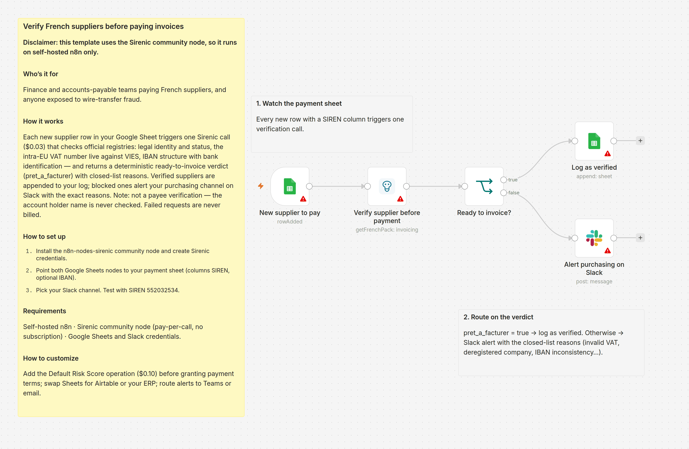
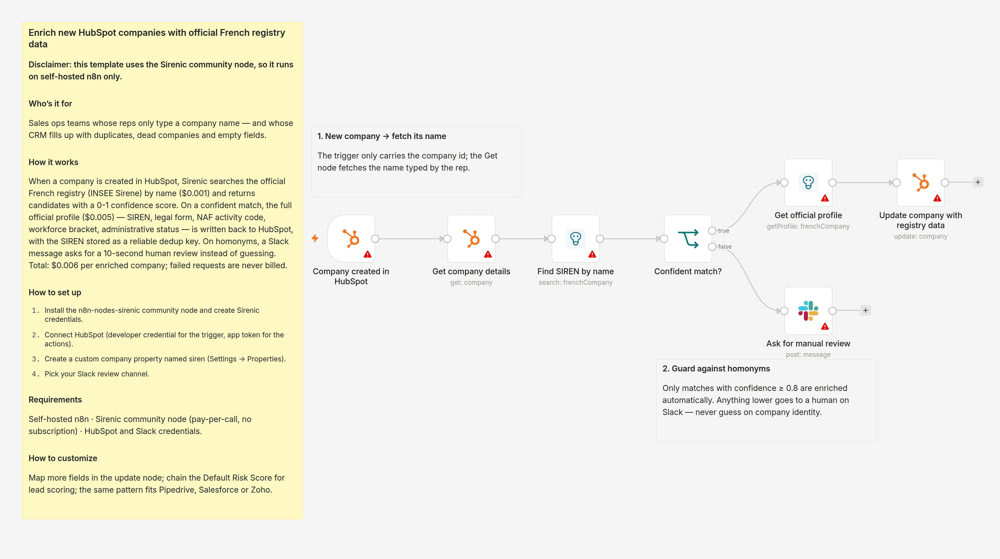
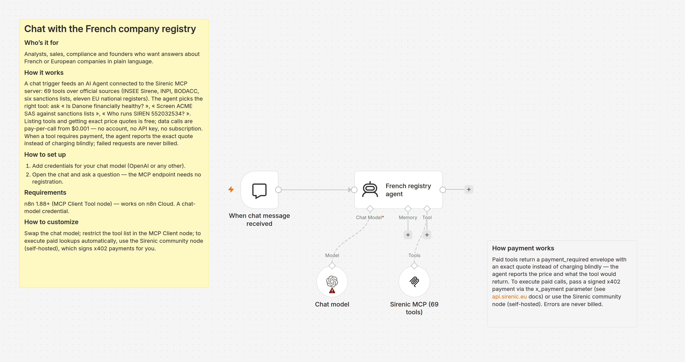
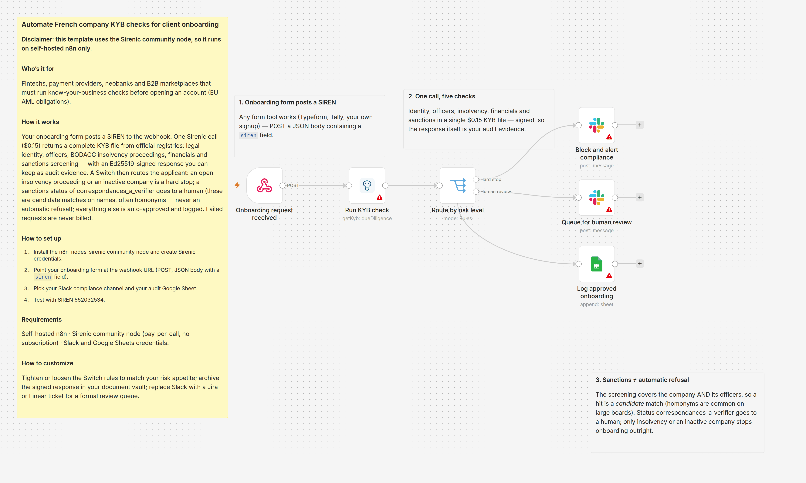
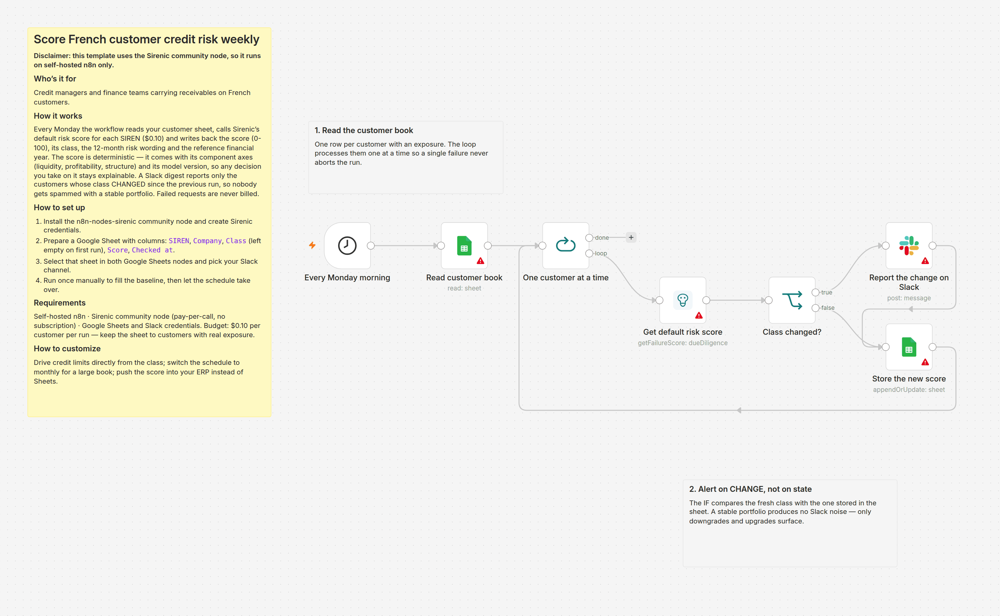
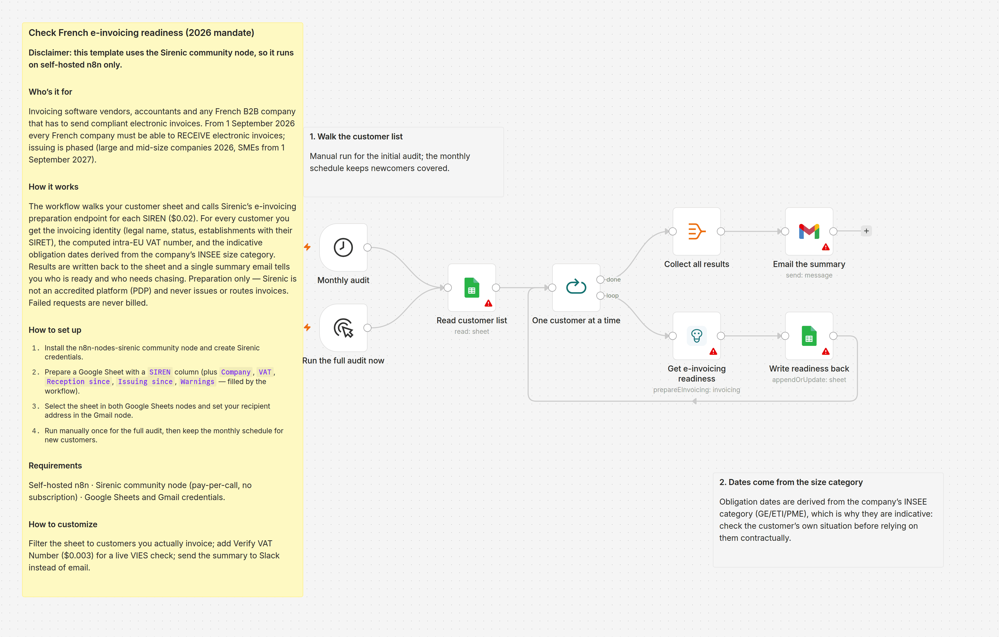

# Ready-to-import n8n workflows

Six ready-to-import workflows built on official French & European company-registry data
(INSEE Sirene, INPI, BODACC, sanctions lists, 11 EU national registers).
Import them via **Workflows → Import from file** in n8n. Errors are never billed.

| File | What it does | Cost per run |
|---|---|---|
| [T10-chat-french-registry-mcp.json](T10-chat-french-registry-mcp.json) | Chat with the French company registry through an AI Agent connected to the Sirenic MCP server (68 tools). Native n8n nodes only — **works on n8n Cloud**, no account, no API key. | free discovery; data calls from $0.002 |
| [T01-verify-french-suppliers.json](T01-verify-french-suppliers.json) | Verify a French supplier before paying an invoice: identity, VAT live against VIES, IBAN + bank identification, deterministic ready-to-invoice verdict. Blocked suppliers alert Slack with closed-list reasons. | $0.03 per supplier |
| [T02-enrich-hubspot-companies.json](T02-enrich-hubspot-companies.json) | Enrich every new HubSpot company with official registry data (SIREN, legal form, NAF, workforce, status), with a confidence-score guard and human review on homonyms. | $0.007 per company |
| [T03-kyb-client-onboarding.json](T03-kyb-client-onboarding.json) | Run a full KYB check when a client signs up: identity, officers, insolvency, financials and sanctions in one call, then route to auto-approve, human review or hard stop. | $0.15 per applicant |
| [T07-score-customer-credit-risk.json](T07-score-customer-credit-risk.json) | Score your French customers' default risk weekly and post a Slack digest of the classes that CHANGED (no noise on a stable book). | $0.10 per customer per run |
| [T08-einvoicing-readiness-2026.json](T08-einvoicing-readiness-2026.json) | Audit every customer's readiness for the French e-invoicing mandate: invoicing identity, computed VAT number, indicative obligation dates. | $0.02 per customer |

## Screenshots

**Verify French suppliers before paying invoices** ([T01](T01-verify-french-suppliers.json))

**Enrich new HubSpot companies with official French registry data** ([T02](T02-enrich-hubspot-companies.json))

**Chat with the French company registry** ([T10](T10-chat-french-registry-mcp.json))

**Automate French company KYB checks for client onboarding** ([T03](T03-kyb-client-onboarding.json))

**Score French customer credit risk weekly** ([T07](T07-score-customer-credit-risk.json))

**Check French e-invoicing readiness (2026 mandate)** ([T08](T08-einvoicing-readiness-2026.json))

## Requirements

- **T10**: any n8n ≥ 1.104 (MCP Client Tool, Streamable HTTP) + chat-model credentials. Nothing else —
  it runs on n8n Cloud.
- **T01, T02, T03, T07, T08**: this community node installed (`n8n-nodes-sirenic`,
  self-hosted) + Sirenic credentials, plus the app credentials each one uses
  (Google Sheets, Slack, HubSpot or Gmail).

Test SIREN: 552032534 (Danone). Docs: https://api.sirenic.eu — OpenAPI, MCP and
payment details. The API is pay-per-call (x402): no subscription, no account; failed
requests are never charged.
